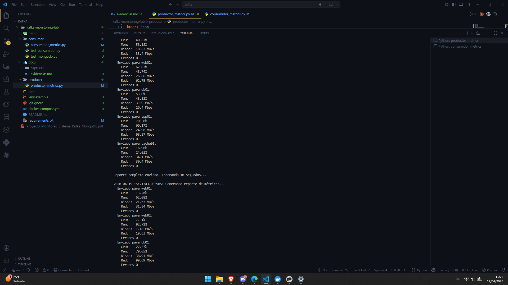
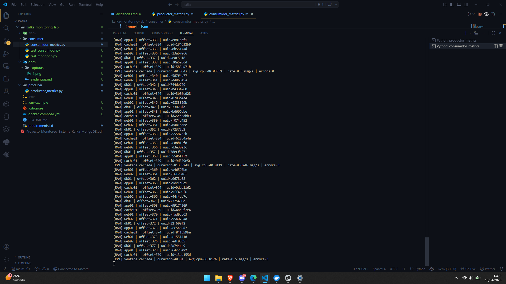
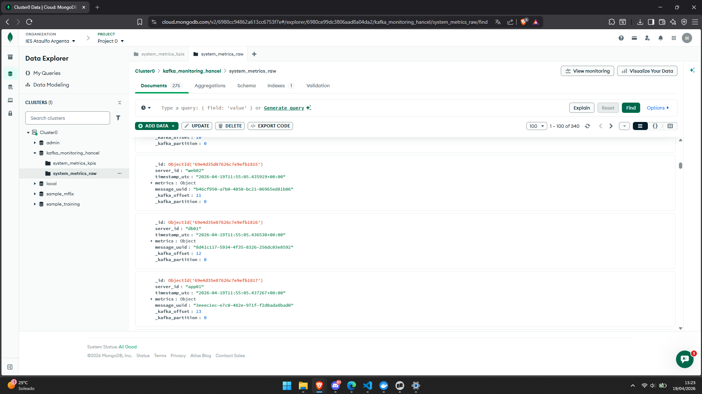
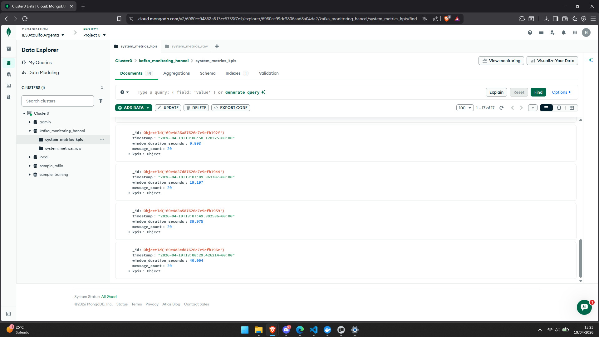

# Evidencias del laboratorio Kafka Monitoring

## Productor enviando datos

En esta captura de muestra como el productor esta en ejecución enviando metricas y almacenandolas en kafka. 

## Consumidor funcionando

El consumidor en ejecución, leyendo los datos del kafka, calculado segundo el número de mensajes y almacenando en mongodb atlas.

## MongoDB RAW

Los datos raw almacenados en mongodb atlas.

## MongoDB KPIs

Los datos ya convertidos en kpis almacenados en mongodb atlas.

